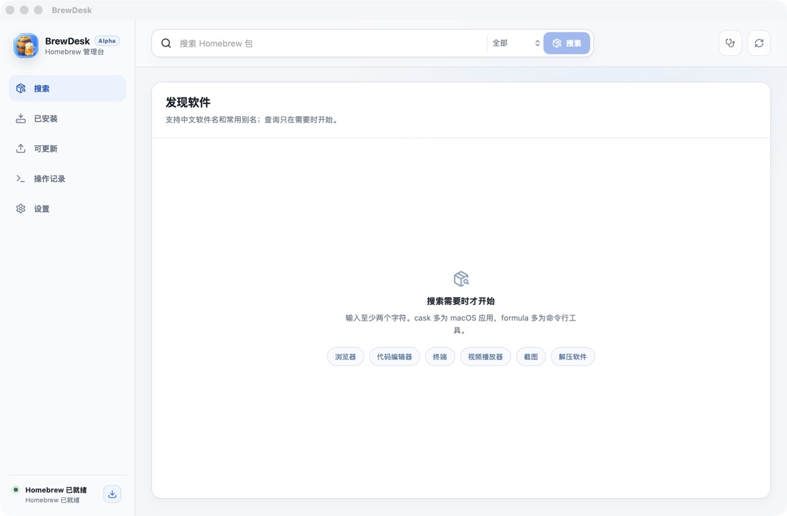

# BrewDesk

> An unofficial, Chinese-first desktop client for Homebrew on macOS. BrewDesk keeps commands visible, detects conflicts with apps installed from other sources, and applies proxy or mirror settings only to the current task.

[简体中文](README.zh-CN.md)

BrewDesk is an independent community project. It is not developed, endorsed, or supported by Homebrew.

## Screenshot



This screenshot was captured from the final Stage A `.app` build and reviewed at full size for private paths, software inventory, tester or recipient information, credentials, private commands, and unrelated applications. See [the capture guide](docs/screenshots/CAPTURE_GUIDE.md).

## Why BrewDesk exists

Homebrew is transparent and powerful, but its terminal-first workflow can be unfamiliar to some Chinese-speaking macOS users. BrewDesk provides a local desktop interface while keeping the actual Homebrew operation visible and preserving Homebrew's command-line behavior.

## Implemented behavior

- Search Formulae and Casks using English names, Chinese names, and curated local aliases.
- Show package details, installed versions, dependencies, Homebrew output, and operation phases.
- Preview the real Homebrew command before an install, uninstall, upgrade, or repair operation.
- Detect declared Cask application paths and warn when an application from another source already occupies the target.
- Distinguish Mac App Store receipts where macOS provides that evidence.
- Queue Homebrew mutations through one worker instead of running them concurrently.
- Display cached outdated-package data immediately and refresh it in the background.
- Apply a system proxy, direct route, or mirror variables to the current child task only.

## Security boundaries

- Homebrew actions are represented as an executable plus an argv array; package tokens are validated before execution.
- UTF-8 is accepted for search text, but mutation targets use a strict token grammar.
- BrewDesk does not persist proxy or mirror settings to Homebrew, macOS, or shell profiles.
- BrewDesk does not collect sudo passwords. Interactive Homebrew installation is delegated to Terminal.
- Other-source application detection is conservative. It cannot reliably distinguish every DMG, PKG, manual copy, or management-system installation.
- No telemetry, account system, analytics SDK, or software-inventory upload is included.

More detail is available in [Security Model](docs/SECURITY_MODEL.md) and [Network Routing](docs/NETWORK_ROUTING.md).

## Platform contract

The current verified target is Apple Silicon (`arm64`) on macOS 26. This does not establish support for Intel Macs, macOS 14, or macOS 15.

The public build contract uses:

- Node.js 24
- npm lockfile installation
- an exact Rust toolchain recorded in `rust-toolchain.toml`
- the project-local `@tauri-apps/cli` 2.11.4

## Source verification

```bash
npm ci
npm test
npm run build
cargo fmt --check --manifest-path src-tauri/Cargo.toml
cargo test --locked --manifest-path src-tauri/Cargo.toml
cargo clippy --locked --manifest-path src-tauri/Cargo.toml --all-targets -- -D warnings
```

Rust, Swift, Vite, Tauri, and `.app` outputs must be directed to a private build root outside the repository. `scripts/build-native-helpers.sh` rejects an unset or in-repository `PUBLIC_BUILD_ROOT`.

The final Bundle Identifier is `io.github.tsing-duan.brewdesk`. The application icon was generated specifically for BrewDesk with Codex and is documented in [Asset Sources](docs/ASSET_SOURCES.md). Ad-hoc verification is a source-build integrity check; it is not Gatekeeper approval, notarization, or binary distribution approval.

## Tests

The Stage A source baseline is 16 frontend tests and 30 Rust tests. Final counts may increase but must never fall below the re-verified baseline. Skipped, ignored, filtered, todo, or empty tests do not count.

## Known limitations

- The interface and user experience have primarily been evaluated in Chinese.
- Network probes cover a bounded group of Homebrew, GitHub, registry, and mirror endpoints; third-party Cask download hosts can still fail independently.
- Application-origin classification is evidence-based but incomplete.
- This Alpha does not include a signed or notarized public binary.
- Binary distribution remains unapproved pending a version-specific third-party notice bundle, signing, notarization, and separate distribution approval.

See [Known Limitations](docs/KNOWN_LIMITATIONS.md) and [Roadmap](docs/ROADMAP.md).

## Contributing and support

Read [CONTRIBUTING.md](CONTRIBUTING.md), [AGENTS.md](AGENTS.md), and [SUPPORT.md](SUPPORT.md) before proposing changes. Security reports follow [SECURITY.md](SECURITY.md).

## License

BrewDesk source is available under the [MIT License](LICENSE). Third-party dependencies and separately licensed material retain their own terms; see [NOTICE.md](NOTICE.md) and [Asset Sources](docs/ASSET_SOURCES.md).

## Independent project notice

Homebrew and related names belong to their respective owners. BrewDesk does not claim official status, endorsement, partnership, or compatibility beyond the evidence recorded in this repository.
